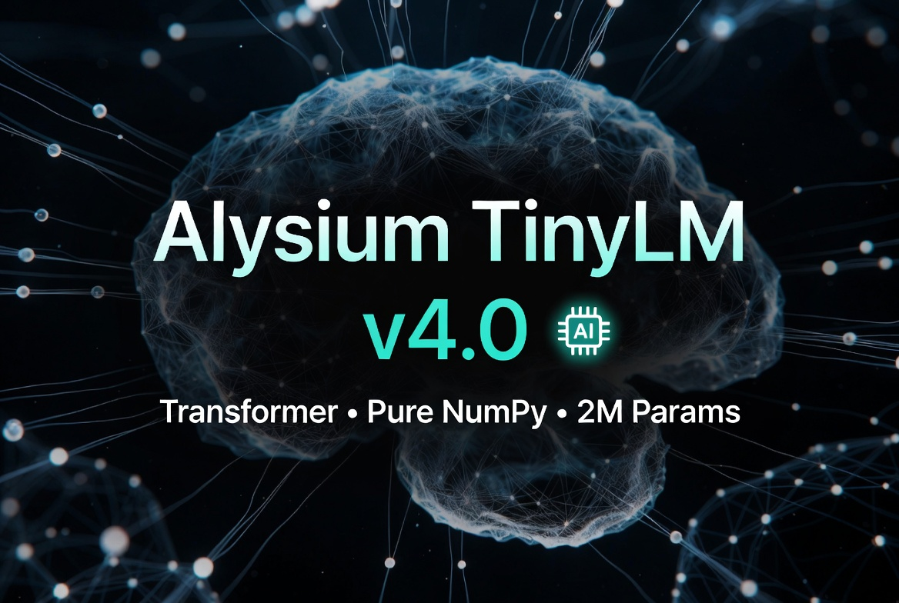

# Alysium TinyLM

**Lightweight • Pure NumPy • Educational**



> A tiny character-free, pure NumPy language model built for learning and experimentation.

[](https://github.com/alysiumcorporationstudios/AlysiumTinyLLM)
[](https://www.python.org/)
[](https://numpy.org/)
[](LICENSE)

---

## What is Alysium TinyLM?

Alysium TinyLM is a **small educational language model** written entirely in pure NumPy.  
It was created to help people understand how language models work under the hood — without heavy frameworks like PyTorch or TensorFlow.

- Word-level next-word prediction
- Extremely lightweight
- Easy to train on your own data
- Simple chat interface
- Perfect for learning and experimentation

---

## Features

- Pure NumPy implementation (no PyTorch / TensorFlow)
- Easy to understand and modify
- Train on your own `dataset.txt`
- Interactive chat mode
- Small enough to run on limited hardware

---

## Quick Start

```bash
# Clone the repository
git clone https://github.com/alysiumcorporationstudios/AlysiumTinyLLM.git
cd AlysiumTinyLLM

# Install dependency
pip install numpy

# Chat with the model
python chat.py
```

---

## Training your own model

1. Edit `dataset.txt` with your own conversations (one utterance per line)
2. Run training:

```bash
python train.py
```

3. After training finishes, a new `tinylm.pkl` will be created.  
4. Run `python chat.py` to talk to your updated model.

---

## Project Structure

```
AlysiumTinyLLM/
├── model.py          # The neural network
├── train.py          # Training script
├── chat.py           # Interactive chat
├── config.py         # Model & training settings
├── dataset.txt       # Training data
├── tinylm.pkl        # Trained model weights
└── README.md
```

---

## Configuration

You can change model size and training settings in `config.py`:

```python
EMBED_DIM = 64
HIDDEN_DIM = 128
CONTEXT_SIZE = 5
EPOCHS = 25
LEARNING_RATE = 0.025
```

---

## Example

```
You: hi
AI:  hello how are you.

You: what is your name
AI:  my name is alysium.

You: bye
AI:  goodbye.
```

---

## Socials

- **X (Twitter):** [@AlysiumCorpZA](https://x.com/AlysiumCorpZA)
- **Instagram:** [@iam_realtoxicdeemodder](https://instagram.com/iam_realtoxicdeemodder)

---

## License

This project is open source under the MIT License.

---

**Made with ❤️ by Alysium Corporation Studios**
